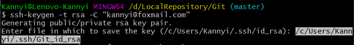
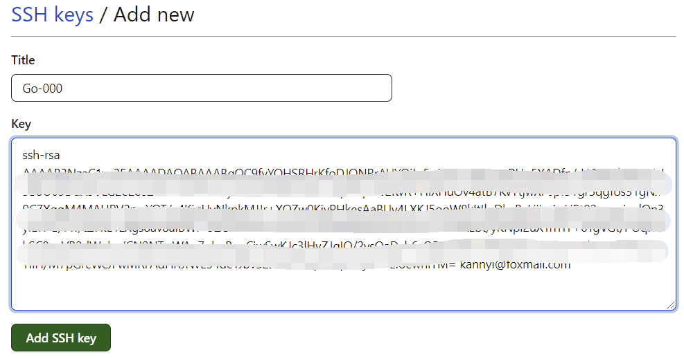

## GitHub的仓库初始化

```bash
cd D:/LocalRepository
mkdir Git #创建一个名叫Git的文件夹
cd Git
ls -al
git init #初始化一个空的Git仓库
ls -al #可以发现多了一个.git目录
git config --global user.name "Kannyi"
git config --global user.email "kannyi@foxmail.com"
git config --global --list #查看配置信息
```

**去GitHub上创建一个新的repository：**


**选择SSH：**


```bash
git remote add Git git@github.com:MyKannyi/Git.git #add一个已经存在的仓库到我们的远程仓库，Git是远程仓库的一个代号，不一定要使用Git这个单词
cd D:/LocalRepository/Git #使用命令时必须处于该仓库的路径下！
git remote #验证远程仓库是否添加成功
ssh-keygen -t rsa -C "kannyi@foxmail.com"

#操作：一般除了保存key的文件名需要自己设置外，剩下的操作只需要一直回车即可，我设置的文件名见下图

cd /c/Users/kannyi/.ssh
ls
cat Git_id_rsa.pub #查看公钥里面有什么内容

#操作：复制公钥的内容
```

**保存key的文件名：**



**进入Settings：**


**创建新的SSH key：**


**粘贴公钥的内容：**


```bash
ssh -T git@github.com #测试一下本地和远程的GitHub是否能成功建立连接

#操作：输入yes（如果有的话）

cd D:/LocalRepository/Git #成功通过认证后，返回我们的Git仓库
git push -u Git master #push一个已经存在的仓库到我们的远程仓库
```

</br>

## Fork他人仓库

**先点击Fork：**


**选择SSH，并点击复制：**


```bash
pwd #查看当前在什么路径下面
cd .. #返回上级目录
git clone git@github.com:MyKannyi/Go-000.git #将fork后的仓库clone到本地，千万不要在一个已存在的Git仓库中使用git clone命令！
cd Go-000/
git remote add Go-000 git@github.com:MyKannyi/Go-000.git
git remote #验证远程仓库是否添加成功
ssh-keygen -t rsa -C "kannyi@foxmail.com"

#操作：一般除了保存key的文件名需要自己设置外，剩下的操作只需要一直回车即可，我设置的文件名见下图

cd /c/Users/kannyi/.ssh
ls
cat Go-000_id_rsa.pub #查看公钥里面有什么内容

#操作：复制公钥的内容
```

**保存key的文件名：**


**进入Settings：**


**创建新的SSH key：**


**粘贴公钥的内容：**



```bash
ssh -T git@github.com #测试一下本地和远程的GitHub是否能成功建立连接
```

<br/>

## 将本地库上传到远程库

```bash
cd D:/LocalRepository/Git
git status #查看是否有新东西要提交
git add .
git commit -m "Update"
git push -u Git master #有些仓库的branch可能不叫master，比如叫main
```

<br/>

## 关键操作示例

```bash
cd D:/LocalRepository/Git
git status #查看是否有新东西要提交
pwd #查看当前目录

#操作：假设往该文件夹中放了一个新文件learn_git.html

git status #发现有一个未被跟踪的文件learn_git.html
git add learn_git.html
git status
git commit -m "Create learn_git.html" #提交更新并加上注释

#操作：假设对learn_git.html进行了修改

git status
git add . #把所有处于已修改状态的文件移到暂存区
git commit -m "Version 1.0" #提交更新并加上注释
clear #清屏
```


<br/>

## 其他操作

```bash
git pull origin master #将远程主机的master分支最新内容拉下来，并与本地分支进行合并
```

```bash
git remote #查看当前的远程仓库
git remote rm Git #移除远程仓库Git
git remote #再次查看，发现远程仓库Git被移除
```

```bash
git push -f origin master #它会忽略版本不一致等问题，强制将本地库上传到远程库，远程库将会被本地库覆盖，慎用！
```

<br/>

## Debug

1. git@github.com: Permission denied (publickey).

```bash
ssh-agent -s
ssh-add ~/.ssh/id_rsa #id_rsa改为相应的rsa文件名，下同

#此时会出现：Could not open a connection to your authentication agent.

ssh-agent bash
ssh-add ~/.ssh/id_rsa
```

